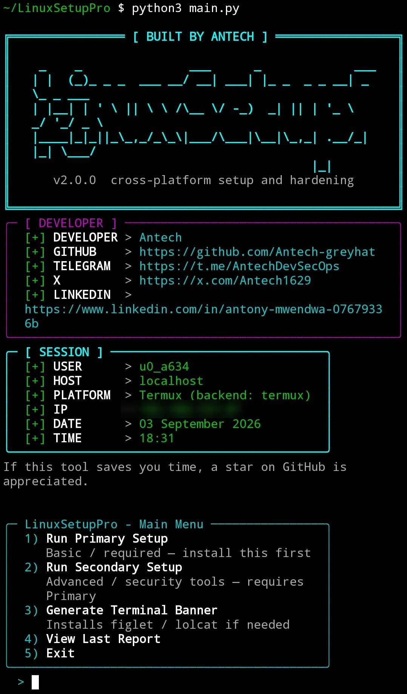
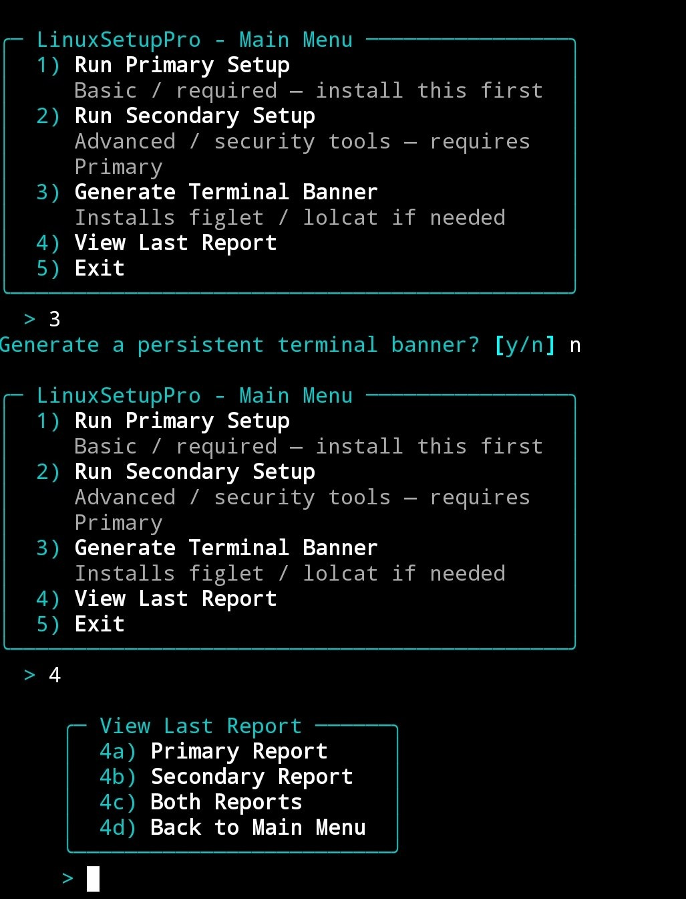
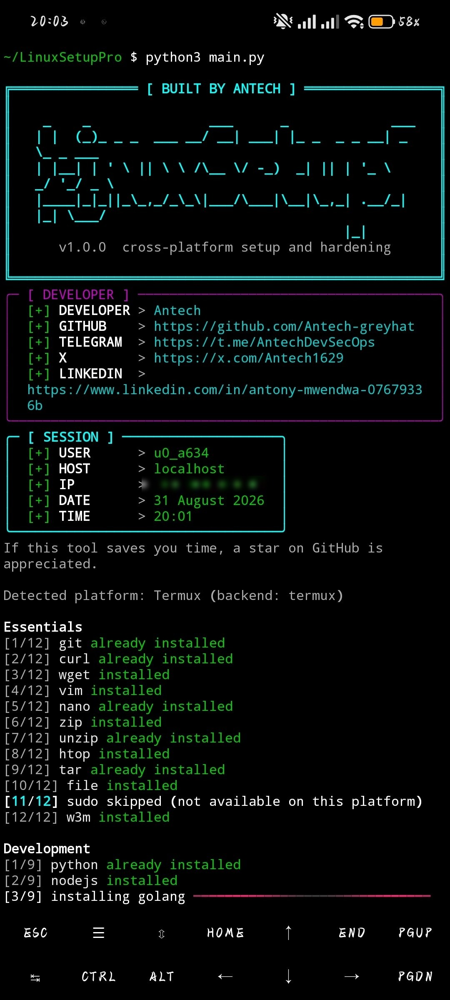
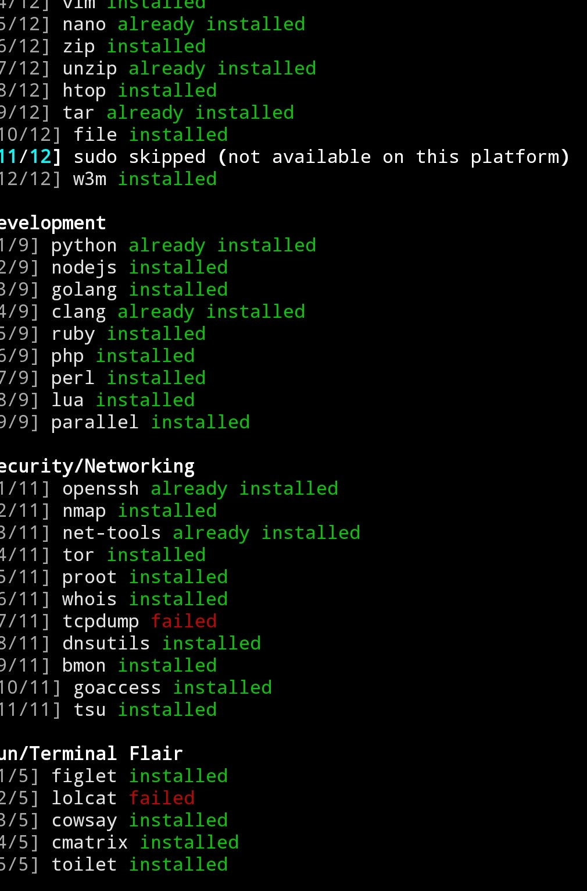
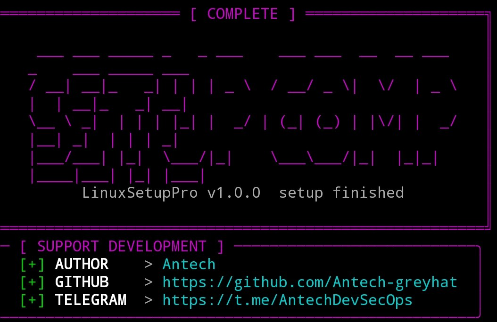

<p align="center">
  
</p>

<p align="center">
  
  
  
  
  
  
  
</p>

LinuxSetupPro is a cross-platform setup and hardening tool for Termux, Debian/Ubuntu, Fedora, and Arch/BlackArch. It installs a curated set of essentials, development runtimes, and networking utilities, then offers an opt-in tier of security and penetration-testing tools, terminal customization, honest per-package reporting, and a persistent terminal banner generator. It detects your platform, picks the right package manager, and never lets one failed package abort the run.

## Table of Contents

| Section | Description |
| --- | --- |
| [Features](#features) | Primary and secondary install categories, progress feedback, reporting |
| [Screenshots](#screenshots) | Visual walkthrough of the tool in action |
| [Requirements](#requirements) | Python version, platform, dependencies |
| [Install on Termux](#install-on-termux) | Step-by-step setup for Termux |
| [Install on Linux](#install-on-linux) | Per-distro instructions for Debian, Fedora, Arch |
| [Updating](#updating) | How to pull the latest changes or pin to a release |
| [CLI Flags](#cli-flags) | All command-line options |
| [Supported Platforms](#supported-platforms) | Detection and backend mapping |
| [FAQ](#faq) | Common questions and answers |
| [Changelog](#changelog) | Version history and what changed in each release |
| [Contributing](#contributing) | How to add packages, error patterns, and new distros |
| [License](#license) | MIT license |
| [Developer](#developer) | Author and social links |

## Features

- Launches into an interactive main menu: run Primary Setup, run Secondary Setup, generate a terminal banner, or view the last report. Nothing installs until you choose it.
- Primary categories installed in order: Essentials, Development, Security/Networking, Fun/Terminal Flair, and an interactive Customization step.
- Opt-in secondary menu of OSINT, network analysis, web-app testing, password-auth, wireless, exploitation, and forensics tools.
- Real progress feedback per package, alternating a progress bar and a spinner, with a distinct color per status.
- Honest error reporting: captured stderr is matched against known patterns to explain the cause and suggest a platform-specific fix. Unrecognized errors are shown verbatim, never invented.
- Per-run reports appended to plain-text files under `reports/`, readable in any editor.
- Persistent hacker-style terminal banner generator with figlet fonts and color schemes.
- `--dry-run` shows exactly what would change without executing anything.

## Screenshots

A live run on Termux — from the fully panelled interactive menu through a finished setup.

<table>
  <tr>
    <td align="center" width="50%" valign="top">
      <br />
      <sub><b>Interactive main menu</b><br />Startup, session, and menu share one panel style. Nothing installs until you choose it.</sub>
    </td>
    <td align="center" width="50%" valign="top">
      <br />
      <sub><b>Consistent panels everywhere</b><br />Every prompt and nested submenu matches the banner styling.</sub>
    </td>
  </tr>
  <tr>
    <td align="center" width="50%" valign="top">
      <br />
      <sub><b>Primary Setup</b><br />Startup banner, then per-package progress.</sub>
    </td>
    <td align="center" width="50%" valign="top">
      <br />
      <sub><b>Honest reporting</b><br />Every package's status, including failures.</sub>
    </td>
  </tr>
</table>

When a run finishes, LinuxSetupPro shows a completion banner:

<p align="center">
  
</p>

## Requirements

- Python 3.8 or newer
- One of the supported platforms and its package manager (pkg, apt, dnf, or pacman)
- Python packages listed in `requirements.txt` (rich, questionary, PyYAML)

## Install on Termux

```bash
apt update && apt upgrade -y
pkg install git python
git clone https://github.com/Antech-greyhat/LinuxSetupPro.git
cd LinuxSetupPro
pip install -r requirements.txt
python3 main.py
```

Termux pip is not externally managed, so no virtual environment is needed. If
`pip` is missing run `python3 -m ensurepip --upgrade` first. If PyYAML fails to
compile, install it from the Termux repo instead: `pkg install python-yaml`.

---

## Install on Linux

### Debian / Ubuntu / Kali / Parrot

```bash
sudo apt update && sudo apt upgrade -y
sudo apt install -y git python3 python3-venv
git clone https://github.com/Antech-greyhat/LinuxSetupPro.git
cd LinuxSetupPro
python3 -m venv .venv
source .venv/bin/activate
pip install -r requirements.txt
python3 main.py
```

### Fedora / RHEL

```bash
sudo dnf upgrade -y
sudo dnf install -y git python3
git clone https://github.com/Antech-greyhat/LinuxSetupPro.git
cd LinuxSetupPro
python3 -m venv .venv
source .venv/bin/activate
pip install -r requirements.txt
python3 main.py
```

### Arch / BlackArch / Manjaro

```bash
sudo pacman -Syu --noconfirm git python
git clone https://github.com/Antech-greyhat/LinuxSetupPro.git
cd LinuxSetupPro
python3 -m venv .venv
source .venv/bin/activate
pip install -r requirements.txt
python3 main.py
```

Modern Kali, Parrot, Debian, Fedora, and Arch mark the system Python as
externally managed (PEP 668), so `pip` refuses to install into it directly. The
virtual environment above avoids that cleanly and keeps the tool's dependencies
out of your system packages. After the first setup, reactivate it before each
run:

```bash
cd LinuxSetupPro
source .venv/bin/activate
python3 main.py
```

Leave the environment at any time with `deactivate`. To install the dependencies
system-wide without a virtual environment instead, run
`pip install --break-system-packages -r requirements.txt` — quicker, but it can
interfere with packages your distro manages.

Python 3.8 or newer is required. Check with `python3 --version` before running.
If your version is older, upgrade it first:

```bash
# Termux
pkg upgrade python

# Debian / Ubuntu
sudo apt install python3.10

# Fedora
sudo dnf install python3.11

# Arch
sudo pacman -Syu python
```

## Updating

To update an existing clone to the latest changes or a new release, pull inside
the project folder and reinstall dependencies in case they changed. On Linux,
activate the virtual environment first; on Termux, skip the `activate` line:

```bash
cd LinuxSetupPro
git pull
source .venv/bin/activate
pip install -r requirements.txt
python3 main.py
```

If `git pull` reports a conflict or fails because of local changes (for example
a shallow clone from an older version), force your copy to match the remote. This
discards local edits inside the folder:

```bash
cd LinuxSetupPro
git fetch origin
git reset --hard origin/main
source .venv/bin/activate
python3 main.py
```

To move to a specific tagged release instead of the latest commit:

```bash
cd LinuxSetupPro
git fetch --tags
git checkout v2.0.0
```

## CLI Flags

| Flag | Description |
| --- | --- |
| `--dry-run` | Show what would install, upgrade, or remove without executing anything. |
| `--only primary` | Run the primary categories only and skip the secondary menu. |
| `--only secondary` | Jump straight to the secondary tools menu. |
| `--set-editor` | Reopen the editor picker, update `EDITOR`, then exit. |
| `--report` | Print the saved installation reports from `reports/` and exit. |
| `--version` | Print the tool version and exit. |
| `--no-banner` | Suppress the startup and end-of-run banners. |
| `--verbose` | Show raw subprocess output instead of the progress widgets. |
| `--remove-banner` | Remove the persistent shell banner block and exit. |
| `--public-ip` | Show your public IP in the startup session block. Makes one outbound request; the default shows the local IP only. |

Running `python3 main.py` with no flags opens the interactive main menu, where you choose Primary Setup, Secondary Setup, banner generation, or the report viewer. Any flag in the table above runs its action directly and bypasses the menu, so scripted and non-interactive use is unchanged. Secondary Setup from the menu requires Primary Setup to have completed at least once and offers to run it first if needed; `--only secondary` skips that check.

## Supported Platforms

| Platform | Backend | Detection |
| --- | --- | --- |
| Termux | pkg | `$PREFIX` contains `com.termux` |
| Debian / Ubuntu | apt | `ID`/`ID_LIKE` in `/etc/os-release` |
| Fedora / RHEL | dnf | `ID`/`ID_LIKE` in `/etc/os-release` |
| Arch / BlackArch / Manjaro | pacman | `ID`/`ID_LIKE` in `/etc/os-release` |

## FAQ

**What happens when a package fails to install?**
The run continues. The package is marked `failed`, and the report records the cause and a platform-specific suggestion when the error is recognized, or the raw stderr when it is not. Reports are appended to plain-text files under `reports/` (`primary_installation.txt` and `secondary_installation.txt`); view them with any editor or run `python3 main.py --report`.

**`pip` says `error: externally-managed-environment`. What do I do?**
Kali, Parrot, and current Debian, Fedora, and Arch releases block installing packages into the system Python (PEP 668). Use the virtual environment shown in [Install on Linux](#install-on-linux): `python3 -m venv .venv && source .venv/bin/activate` before `pip install -r requirements.txt`. Remember to run `source .venv/bin/activate` again in new terminals before `python3 main.py`.

**`ModuleNotFoundError: No module named 'questionary'` (or `rich`, `yaml`).**
The dependencies did not install, usually because of the error above, or because the virtual environment is not active. Activate it (`source .venv/bin/activate`) and run `pip install -r requirements.txt` again.

**How do I remove the terminal banner?**
Run `python3 main.py --remove-banner`. It strips the marked block from your `.bashrc` or `.zshrc`. Restart your terminal afterwards.

**Does this work on rooted devices or unrooted Termux?**
It works on both. Tools marked `[LOCKED]` need a proot Linux chroot or root access to function fully. On stock, unrooted Termux they may install but not run as expected. Use `proot-distro` to set up a Kali or Parrot chroot for those.

**How do I add a custom package?**
Edit `config/packages.yaml` and add an entry with its per-backend package names. No code changes are needed. See [CONTRIBUTING.md](CONTRIBUTING.md).

## Changelog

| Version | Released | Status |
| --- | --- | --- |
| v2.0.0 | 2026-09-03 | Latest |
| v1.0.0 | 2026-08-05 | Initial release |

### v2.0.0 (latest)

- Interactive main menu on launch: choose Primary Setup, Secondary Setup, terminal banner generation, or the report viewer. Nothing installs until you pick it.
- Secondary Setup is gated behind a completed Primary run, tracked by a `.state/primary_completed` marker, and offers to run Primary first if needed. `--only secondary` skips the check.
- Built-in "View Last Report" submenu: open the primary report, secondary report, or both. It opens in nano by default, falls back to your configured `EDITOR`, prints the path if no editor is available, and shows per-editor exit-key hints so you are never trapped in the editor.
- Reports are appended to plain-text files under `reports/`, readable in any editor or with `python3 main.py --report`.
- New `--public-ip` flag shows your public IP in the startup session block instead of the local IP.
- Fixed installs on PEP 668 systems (Kali, Parrot, and current Debian, Fedora, and Arch): the docs now use a virtual environment, with a `--break-system-packages` fallback. This resolves `externally-managed-environment` and the resulting `ModuleNotFoundError`.
- Hardening: every CLI flag now reliably bypasses the menu so scripted and non-interactive use is unchanged, and the report viewer no longer crashes on a malformed `EDITOR` value.

### v1.0.0

- Initial release: cross-platform primary and secondary installer for Termux, Debian/Ubuntu, Fedora, and Arch/BlackArch.
- Automatic platform detection and package-manager backend selection (pkg, apt, dnf, pacman).
- Per-package progress feedback that never lets one failed package abort the run.
- Startup and completion banners with the developer info block.

## Contributing

Contributions are welcome. See [CONTRIBUTING.md](CONTRIBUTING.md) for how to add packages, error patterns, and new distributions.

## License

Released under the [MIT License](LICENSE), copyright Antech.

## Developer

Built and maintained by Antech.

| Platform | Link |
| --- | --- |
| GitHub | [Antech-greyhat](https://github.com/Antech-greyhat) |
| Telegram | [AntechDevSecOps](https://t.me/AntechDevSecOps) |
| X (Twitter) | [Antech1629](https://x.com/Antech1629) |
| LinkedIn | [Antony Mwendwa](https://www.linkedin.com/in/antony-mwendwa-07679336b) |
| WhatsApp | [+254714452396](https://wa.me/254714452396) |

---

Built by Antech. If LinuxSetupPro is useful to you, consider a star and a follow at [github.com/Antech-greyhat](https://github.com/Antech-greyhat).
